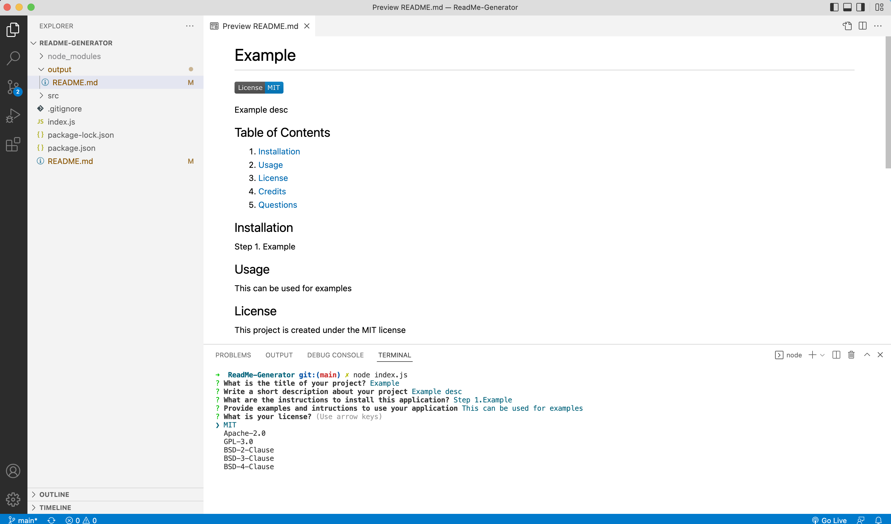

# README-Generator

This application is designed to produce high-quality README files for a user. I was motivated by the idea of streamlining my README creating process, as there is a lot of repetition in the structure and design of READMEs and I wanted to simplify the steps. I built this application to enable the quick and effective production of a README file to suit any type of application. I learnt a great deal about the power of node.js and writing files through creating this project

## Table of Contents

1.  [Installation](#installation)
2.  [Usage](#usage)
3.  [License](#license)
3.  [Credits](#credits)
4.  [Questions](#questions)

## Installation 

1. Clone my repository to your device 
2. Open in VS code 
3. Open the integrated terminal within the file location 
4. Enter "npm -init -y" to initialise npm 
5. Enter "npm install inquirer" to install inquirer

## Usage

To use the application, simply enter "node index.js" within the integrated terminal within the file location and fill in all the prompts. This can be used to produce a README for any type of application, including an app which displays the weather, or even an app which generates READMEs!

[Click HERE to watch a video on how to install and use the README generator!](https://drive.google.com/file/d/1ksIJRohcy5pO3HlkIPssiawa0KrTkxjJ/view)

Demo screenshot

## License
This project is created under the MIT license

## Credits
This project was created by [kieranmichaelflynn](https://github.com/kieranmichaelflynn)

## Questions
To see it yourself, visit my GitHub repository at https://github.com/kieranmichaelflynn/ReadMe-Generator.git

If you have any further questions, reach out to me at kieranmichaelflynn@gmail.com 

Thank you for reading, enjoy README-Generator!
    
